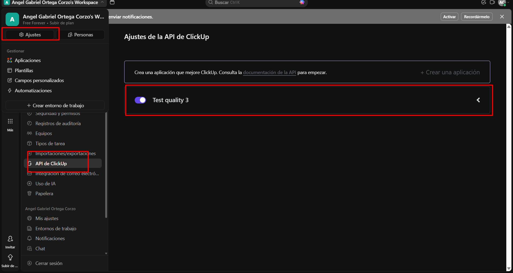
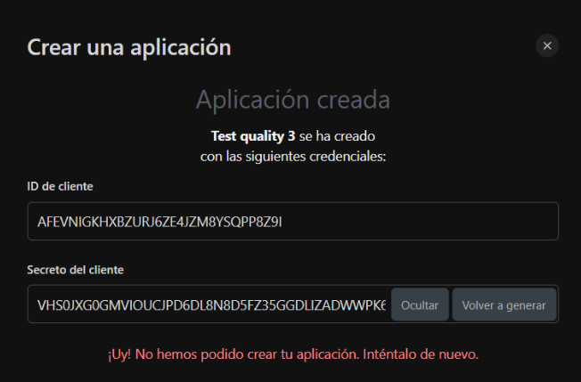
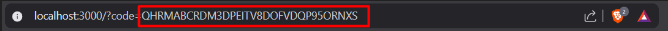
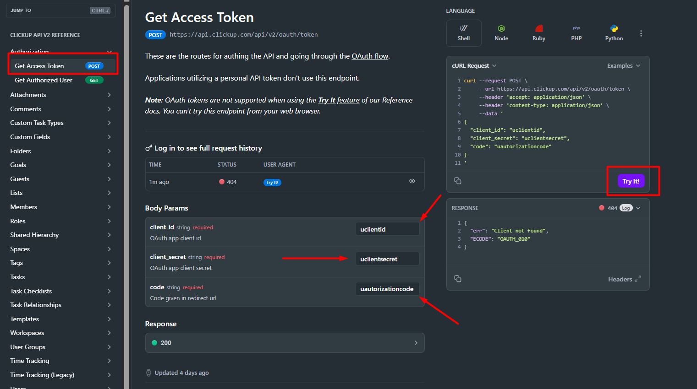

# setup process

firts of all you need to create and new aplication, this will generate you a client, id and secret







after that u need to get a autorization code into your account, this can be posible doing the following steps:

enter in the url

https://app.clickup.com/api?client_id=AFEVNIGKHXBZURJ6ZE4JZM8YSQPP8Z9I&redirect_uri=http://localhost:3000

u can replace that four u client id with the one you generated in the first step, and u will copy the code in the url as the following instruction:





finally you just need to replace each part of the code with the one you generated in the first step, and u will get the following result, u can use the following curl:

```bash
curl --request POST \
     --url https://api.clickup.com/api/v2/oauth/token \
     --header 'accept: application/json' \
     --header 'content-type: application/json' \
     --data '
{
  "client_id": "uclientid",
  "client_secret": "uclientsecret",
  "code": "uautorizationcode"
}
'
```

if u dont want to use the curl u can go into [clickup website](https://developer.clickup.com/reference/getaccesstoken)





after that u can get the token, just copy it.
